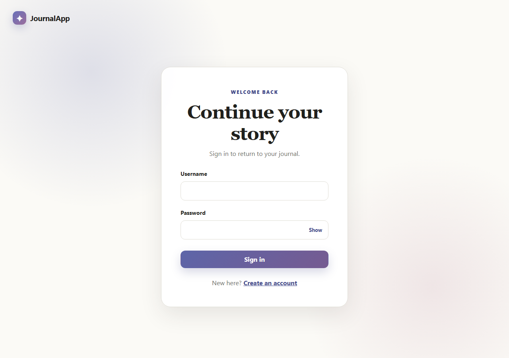

# The Journal

The Journal is a personal journaling application with a Spring Boot API, the original Next.js/React client, and a new production-ready Angular client. The React application remains intact at the repository root; the Angular implementation is additive.


## Architecture

```text
.
├── app/, components/, hooks/, lib/   Original Next.js/React frontend
├── angular-frontend/                 Angular 21 standalone application
│   └── src/app/
│       ├── core/                     Typed models, services, guard, interceptor
│       ├── features/                 Landing, auth, journal CRUD pages
│       └── shared/                   Header, status, journal card components
├── backend/
│   ├── journaling/                   Spring Boot 3.3 / Java 21 API
│   └── docker-compose.yml            MongoDB, Redis, Kafka
└── .github/workflows/ci.yml          Maven and Angular verification
```

The Angular client uses standalone components, lazy Angular Router routes, Reactive Forms, HttpClient, SCSS, and typed API models. Protected routes pass through `authGuard`; API requests pass through `jwtInterceptor`, which attaches the stored bearer token and clears expired sessions after a `401`.

The backend retains MongoDB persistence, Redis caching, Kafka integration classes, JWT security, mail/weather integrations, and scheduled processing. Production support adds DTO validation, consistent JSON errors, Actuator health endpoints, OpenAPI/Swagger UI, dependency containers, isolated tests, and externalized secrets.

## Prerequisites

- Node.js 22 and npm 11
- JDK 21
- Docker Desktop or Docker Engine with Compose (for local backend dependencies)

## Local setup

### 1. Start backend dependencies

```bash
cd backend
docker compose up -d
```

MongoDB starts as a single-node replica set on `27017`, Redis on `6379`, and Kafka in KRaft mode on `9092`.

### 2. Start the Spring Boot API

```bash
cd backend/journaling
./mvnw spring-boot:run
```

On Windows, use `mvnw.cmd spring-boot:run`. The API listens on `http://localhost:8080`. Useful endpoints:

- Health: `http://localhost:8080/actuator/health`
- Liveness: `http://localhost:8080/actuator/health/liveness`
- Swagger UI: `http://localhost:8080/swagger-ui.html`
- OpenAPI document: `http://localhost:8080/v3/api-docs`

### 3. Start the Angular frontend

```bash
cd angular-frontend
npm ci
npm start
```

Open `http://localhost:4200`. Development builds use `http://localhost:8080` from `src/environments/environment.development.ts`. Production builds use the deployed API URL from `src/environments/environment.ts`.

### Original React frontend

The existing React/Next.js frontend is unchanged and remains runnable from the repository root:

```bash
npm install
npm run dev
```

It listens on `http://localhost:3000` by default.

## Environment variables

All secrets must be supplied at runtime; no production credentials are committed.

| Variable | Default | Purpose |
|---|---|---|
| `SPRING_PROFILES_ACTIVE` | `dev` | Spring profile |
| `PORT` | `8080` | API port |
| `SPRING_DATA_MONGODB_URI` or `MONGODB_URI` | local replica set | MongoDB connection URI |
| `SPRING_DATA_MONGODB_DATABASE` | `JournalDb` | MongoDB database |
| `REDIS_HOST` / `REDIS_PORT` / `REDIS_PASSWORD` | `localhost` / `6379` / empty | Redis connection |
| `KAFKA_BOOTSTRAP_SERVERS` | `localhost:9092` | Kafka brokers |
| `JWT_SECRET` | development-only fallback | HMAC signing secret; set a strong secret in production |
| `JWT_EXPIRATION_MS` | `3600000` | JWT lifetime in milliseconds |
| `SPRING_MAIL_HOST` / `SPRING_MAIL_PORT` | Gmail / `587` | SMTP server |
| `SPRING_MAIL_USERNAME` / `SPRING_MAIL_PASSWORD` | empty | SMTP credentials |
| `WEATHER_API_KEY` | empty | Weather integration key |
| `CORS_ALLOWED_ORIGINS` | local Angular/React plus current deployed React origin | Comma-separated browser origins |
| `APP_LOG_LEVEL` | `INFO` | Application package log level |

For Angular deployments, update `angular-frontend/src/environments/environment.ts` during the deployment pipeline or before building. API addresses are not duplicated in components or services.

## API integration contract

The Angular frontend preserves the existing case-sensitive backend routes:

| Operation | Method and path | Body / response |
|---|---|---|
| Register | `POST /public/SignUp` | `{ userName, email, password }` |
| Login | `POST /public/Login` | `{ userName, password }`; plain-text JWT response |
| List entries | `GET /journal` | `JournalEntry[]` (the client also treats the legacy empty `404` as `[]`) |
| Create entry | `POST /journal` | `{ title, content }` |
| View entry | `GET /journal/id/{id}` | `JournalEntry` |
| Update entry | `PUT /journal/id/{id}` | `{ title, content }` |
| Delete entry | `DELETE /journal/id/{id}` | `204 No Content` |
| Greeting | `GET /user` | Plain text |

All routes except `/public/**`, Swagger/OpenAPI, and Actuator health require `Authorization: Bearer <token>`. Validation and server errors use a stable JSON body with `timestamp`, `status`, `error`, `message`, `path`, and optional `validationErrors`.

## Testing and builds

Angular:

```bash
cd angular-frontend
npm run test:ci
npm run build
```

The unit suites cover the authentication service, journal service, auth guard, JWT interceptor, root accessibility shell, login and registration forms, journal editor behavior, and dashboard states.

Backend:

```bash
cd backend/journaling
./mvnw test
./mvnw verify
```

The backend tests use JUnit 5, Mockito, and standalone MockMvc. They do not need MongoDB, Redis, Kafka, SMTP, or a weather service. JaCoCo writes its report during `verify` to `target/site/jacoco/`.

GitHub Actions runs both suites and both production/package builds on pushes to `main` and on pull requests. The inspected upstream backend did not contain committed SonarCloud project identifiers or a workflow, so no organization/key values were guessed; an externally configured SonarCloud project can continue consuming the JaCoCo report.

## Screenshots

These images were captured from the locally compiled Angular application.

### Landing page


### Login



## Deployment

### Angular static deployment

1. Set the production `apiBaseUrl`.
2. Run `npm ci && npm run build` in `angular-frontend/`.
3. Publish `angular-frontend/dist/angular-frontend/browser/`.
4. Configure the host to rewrite unknown routes to `index.html` so Angular Router deep links work.

The output is suitable for static hosts such as Nginx, Render Static Sites, Netlify, or Vercel.

### Backend container deployment

From `backend/`:

```bash
docker build -t the-journal-api .
docker run --rm -p 8080:8080 \
  -e SPRING_PROFILES_ACTIVE=prod \
  -e SPRING_DATA_MONGODB_URI='mongodb://...' \
  -e JWT_SECRET='replace-with-a-strong-secret' \
  -e CORS_ALLOWED_ORIGINS='https://journal.example.com' \
  the-journal-api
```

Set all applicable environment variables through the deployment platform. Render can use `backend/render.yaml`; its health probe targets Actuator.

## Module Federation evaluation

Module Federation was evaluated after the standalone application passed its tests and production build. It was deliberately deferred: journal management and authentication currently share one release boundary, there is no independent remote deployment requirement, and introducing a shell/remote toolchain would add runtime version coordination and a second failure boundary without user-facing value. The feature-based Angular layout already provides the separation needed today. A shell plus journal remote becomes worthwhile when those areas need independent teams or release schedules; the current `features/journal` boundary is ready to extract then.

## Accessibility and UX

The Angular UI includes semantic landmarks, a skip link, visible keyboard focus, associated labels, live status/error messaging, reduced-motion support, responsive layouts, native confirmation dialogs, loading skeletons, validation feedback, retry handling, and empty/success/error states. Theme preference is persisted locally.
